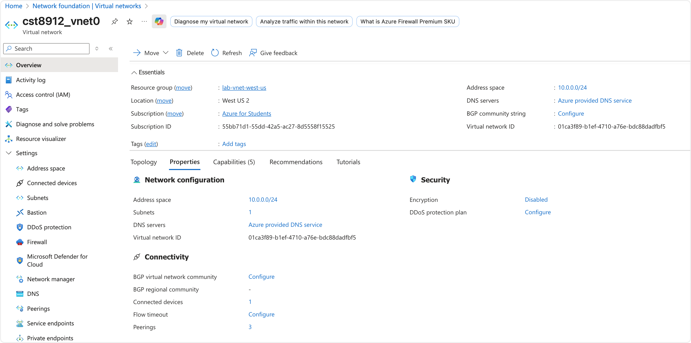

# Lab 2 - CST8912 – Cloud Solution Architecture - Junfeng RONG - 041176879


## step 1: Create Resource Group

Create a Resource Group named `lab-vnet-west-us` in the 'West US 2' region.


## step 2: Create Virtual Network

| virtual network | address space | region    | resource group   |
| --------------- | ------------- | --------- | ---------------- |
| cst8912_vnet0   | 10.0.0.0/24   | West US 2 | lab-vnet-west-us |
| cst8912_vnet1   | 10.10.0.0/24  | West US 2 | lab-vnet-west-us |
| cst8912_vnet3   | 10.30.0.0/24  | West US 3 | lab-vnet-west-us |

> **Note**: I also created cst8912_vnet2 (10.20.0.0/24) in Mexico Central, but could not deploy a VM there due to the unavailability of compatible VM si,lzes in that region.

## step 3: Review VNet Configurations
| virtual network | address space | region         | description |
| --------------- | ------------- | -------------- | ----------- |
| cst8912_vnet0   | 10.0.0.0/24   | West US 2      |             |
| cst8912_vnet1   | 10.10.0.0/24  | West US 2      |             |
| cst8912_vnet2   | 10.20.0.0/24  | Mexico Central | unused      |
| cst8912_vnet3   | 10.30.0.0/24  | West US 3      |             |





## step 4: Configure Peerings

- Add cst8912_vnet1 to the peerings of cst8912_vnet0 as cst8912_vnet0_to_cst8912_vnet1
- Add cst8912_vnet3 to the peerings of cst8912_vnet0 as cst8912_vnet0_to_cst8912_vnet3
- Add cst8912_vnet3 to the peerings of cst8912_vnet1 as cst8912_vnet1_to_cst8912_vnet3


## step 4: Deploy Virtual Machines

- vm0 – Region: West US 2, VNet: cst8912_vnet0 (Subnet: default 10.0.0.0/24), Image: *Windows Server 2019 Datacenter*, Size: Standard_B1s
- vm1 – Region: West US 2, VNet: cst8912_vnet1 (Subnet: default 10.10.0.0/24), Image: *Windows Server 2019 Datacenter*, Size: Standard_B1s
- myvm – Region: West US 3, VNet: cst8912_vnet3 (Subnet: default 10.30.0.0/24), Image: *Windows Server 2019 Datacenter*, Size: Standard_B1s


## step 5: Test Connectivity

- From vm0 to vm1:  

```cmd
Test-NetConnection -ComputerName 10.10.0.4 -Port 3389 -InformationLevel Detailed
```

- From vm0 to vm3:  

```cmd
Test-NetConnection -ComputerName 10.30.0.4 -Port 3389 -InformationLevel Detailed
```

- From vm1 to vm3:  

```cmd
Test-NetConnection -ComputerName 10.30.0.4 -Port 3389 -InformationLevel Detailed
```


## Findings & Analysis

### Why VNet peering is important?
VNet peering is important because it allows virtual machines in different virtual networks to communicate with each other as if they were in the same network.


### How private IP communication was established
Private IP communication was established using the peering connection between the two virtual networks.

### Benefits of global peering (performance & security)
- Performance: Global peering allows virtual machines to communicate with each other using private IP addresses, which results in faster communication compared to using public IP addresses.
- Security: Global peering allows virtual machines to communicate with each other using private IP addresses, which provides an additional layer of security compared to using public IP addresses.

